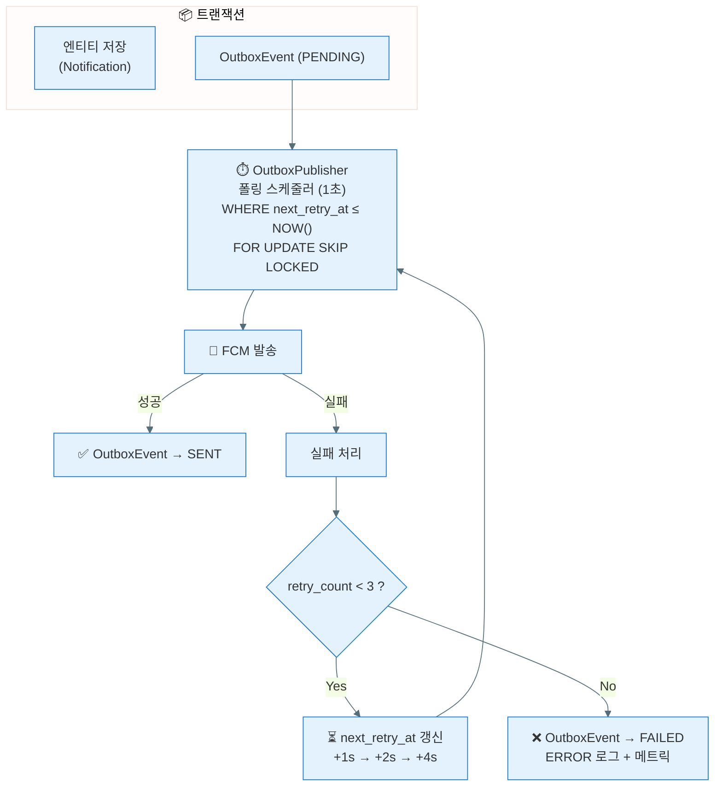
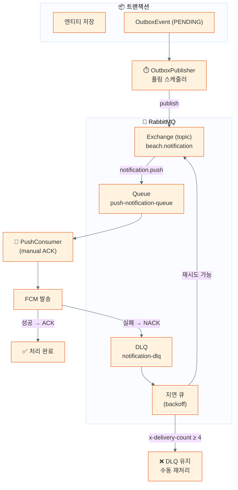
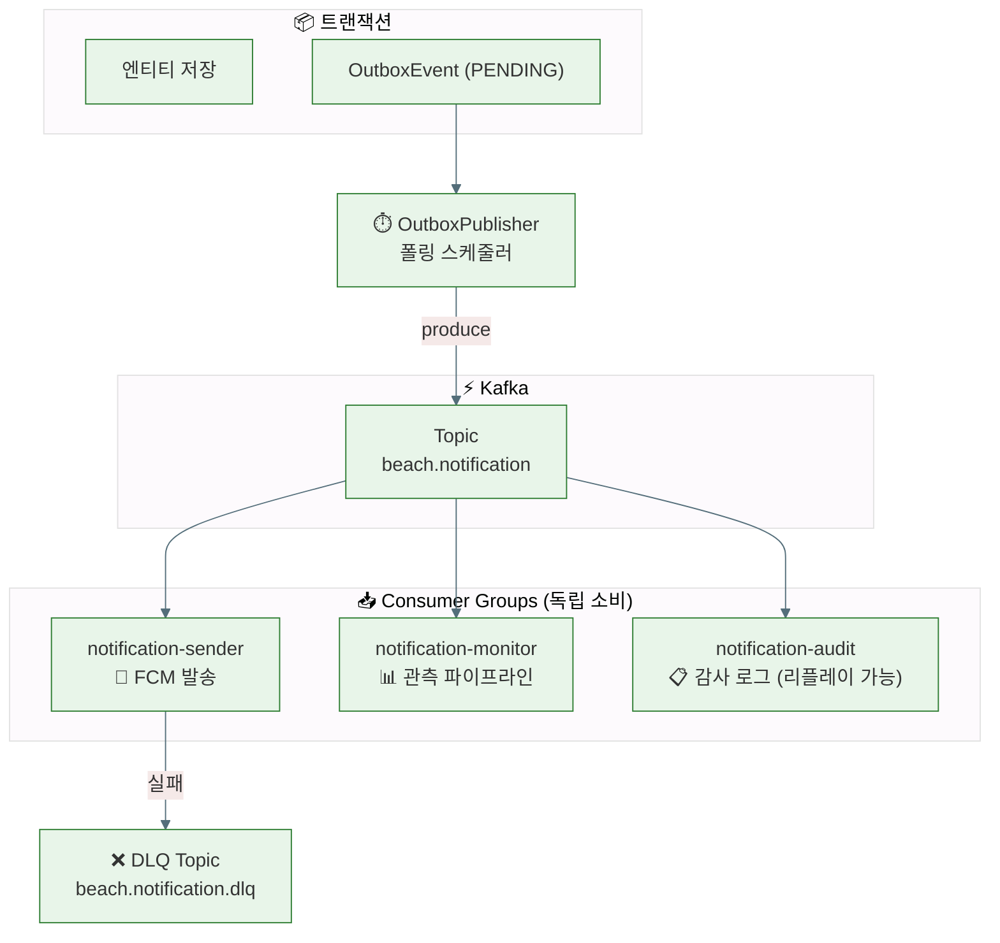

# Outbox 이벤트 전달 구조 비교

세 가지 구조를 비교합니다. 공통 부분(트랜잭션 내 Outbox 저장)과 그 이후 전달/재시도 구조가 달라집니다.

| 구조 | 상태 | 참조 |
|:---|:---:|:---|
| Outbox + DB폴링워커 | **현재 구현 대상** | ADR-008 |
| Outbox + RabbitMQ | Rejected | ADR-007 |
| Outbox + Kafka | 관측 스프린트 후 검토 | 별도 ADR 예정 |

관련 문서:
- [ADR-008 — Outbox + DB폴링워커 도입](../adr/ADR-008-outbox-db-polling-worker.md)
- [ADR-007 — RabbitMQ (Rejected)](../adr/ADR-007-rabbitmq-push-notification-broker.md)
- [PB-82 로드맵](../PB-82-outbox-polling-kafka-roadmap.md)

---

## 1. Outbox + DB폴링워커

> 브로커 없음. OutboxPublisher가 직접 FCM으로 발송.
> 재시도는 `next_retry_at` + exponential backoff 기반 폴링으로 자동 재시도.
> OutboxEvent 최종 상태: `SENT` / `FAILED`

---

## 2. Outbox + RabbitMQ

> 브로커(RabbitMQ)를 중간에 배치. OutboxPublisher는 publish만 담당.
> Consumer가 실제 발송을 처리하고, 재시도는 DLQ + 지연 큐 토폴로지로 처리.
> OutboxPublisher는 Publisher Confirm ACK 수신 후 OutboxEvent → `PUBLISHED`.

---

## 3. Outbox + Kafka

> 다중 Consumer Group. 같은 이벤트를 독립적으로 소비하는 Consumer Group이 추가 가능.
> 관측 스프린트와 연결: 발송 외에 관측 파이프라인, 감사 로그 Consumer가 독립 소비.
> 리플레이: offset 조작으로 과거 이벤트 재소비 가능.
> OutboxPublisher는 produce 완료 후 OutboxEvent → `PUBLISHED`.

---

## 구조별 비교

| 비교 포인트 | DB폴링워커 | RabbitMQ | Kafka |
|:---|:---:|:---:|:---:|
| 추가 인프라 | 없음 | RabbitMQ 컨테이너 | Kafka 클러스터 |
| 발송 주체 | OutboxPublisher 직접 | Consumer | Consumer |
| 소비 모델 | 폴링 (pull) | Push (ACK 기반) | Pull (offset 기반) |
| 다중 독립 소비자 | ❌ | ⚠️ 별도 Queue 필요 | ✅ Consumer Group |
| 리플레이 | ❌ | ❌ | ✅ (offset 조작) |
| 재시도 방식 | backoff 폴링 | DLQ + 지연 큐 토폴로지 | DLQ topic |
| OutboxEvent 최종 상태 | SENT | PUBLISHED | PUBLISHED |
| 운영 복잡도 | 낮음 | 중간 | 높음 |
