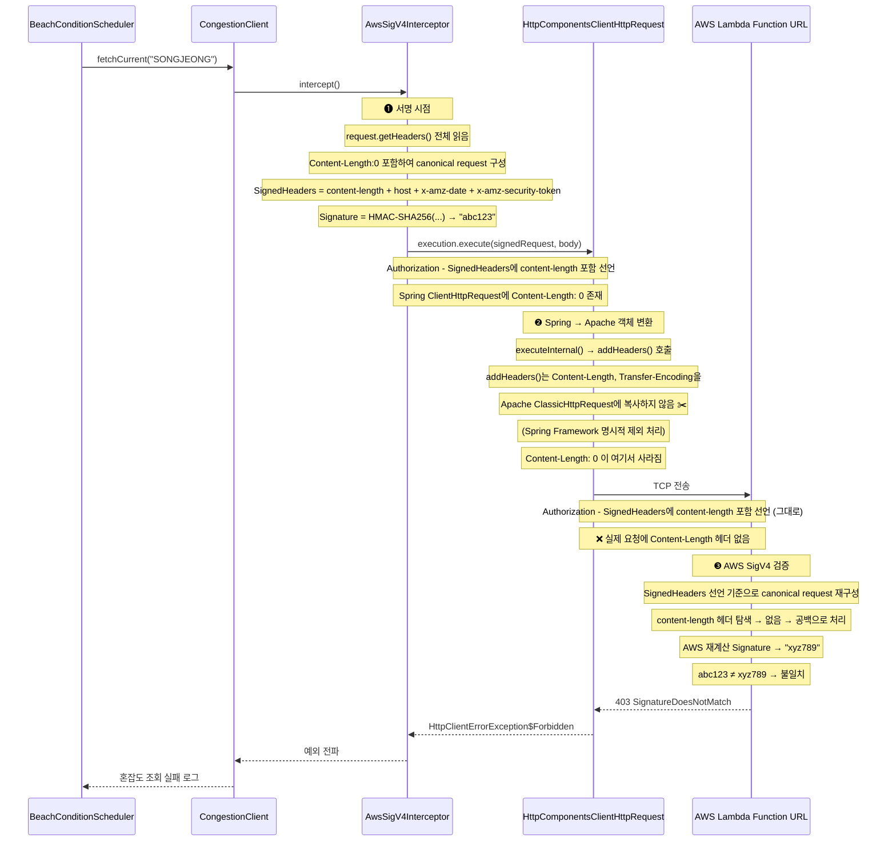

# SigV4 Content-Length 서명 불일치 버그 다이어그램

| 날짜 | 작성자 | 변경 내용 |
|:---:|:---:|:---|
| 2026-04-04 | 박건우(@geonusp) | 문서 생성 |
| 2026-04-04 | 박건우(@geonusp) | 제거 위치 정정 (RequestContent → Spring addHeaders) |

관련 트러블슈팅: `docs/troubleshooting/lambda-function-url-sigv4-signature-mismatch.md`

---

---

## 핵심 모순

| 시점 | Content-Length | Signature |
|:-----|:--------------|:----------|
| 서명 시점 (AwsSigV4Interceptor) | 존재 (`content-length: 0`) | `abc123` |
| 전송 시점 (addHeaders 이후) | 제거됨 | - |
| AWS 검증 시점 | 없음 → 공백으로 재계산 | `xyz789` |

**범인:** Spring `HttpComponentsClientHttpRequest.addHeaders()`가 Apache 객체로 변환 시 `Content-Length`, `Transfer-Encoding`을 명시적으로 복사하지 않음

**소스:**
- [HttpComponentsClientHttpRequest.java - addHeaders()](https://github.com/spring-projects/spring-framework/blob/main/spring-web/src/main/java/org/springframework/http/client/HttpComponentsClientHttpRequest.java)
- [RequestContent.java](https://github.com/apache/httpcomponents-core/blob/master/httpcore5/src/main/java/org/apache/hc/core5/http/protocol/RequestContent.java)
