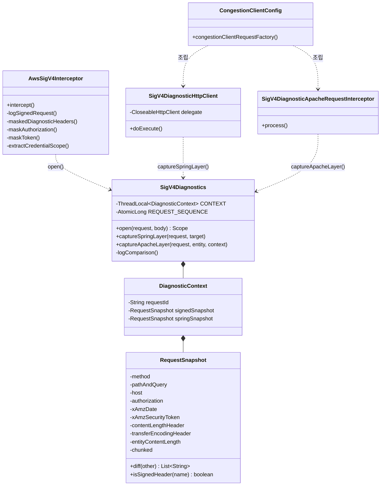
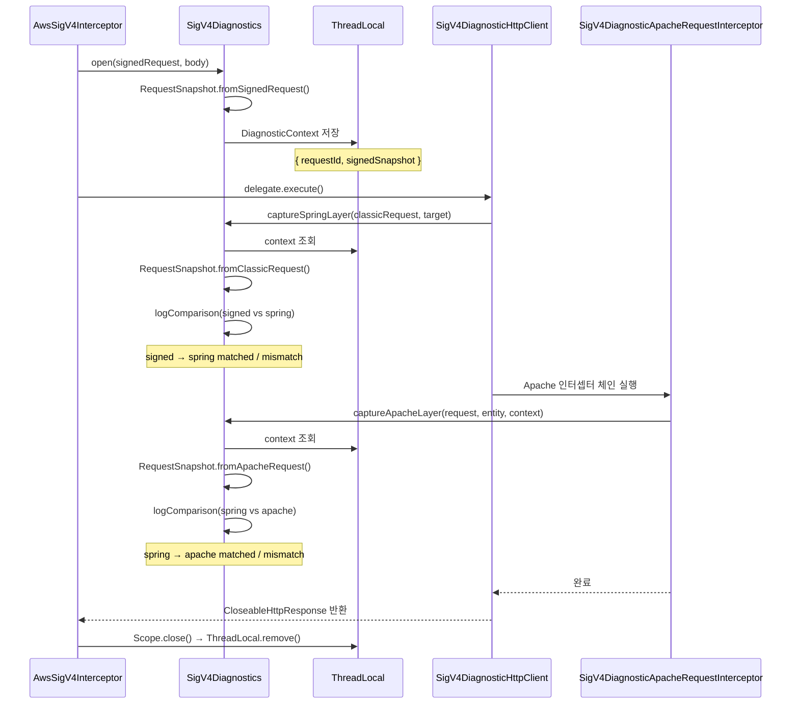
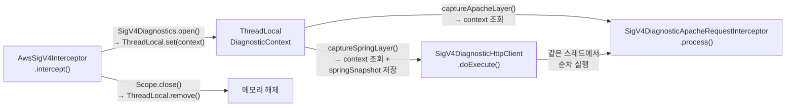
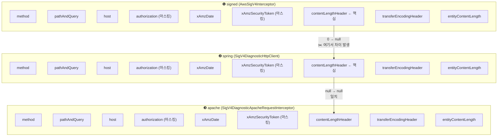
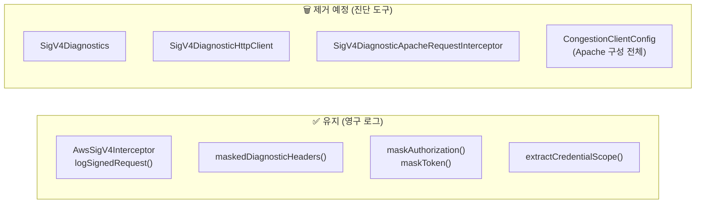

# SigV4 진단/로그 구조 다이어그램

| 날짜 | 작성자 | 변경 내용 |
|:---:|:---:|:---|
| 2026-04-04 | 박건우(@geonusp) | 문서 생성 |

---

## 1. 전체 클래스 관계



---

## 2. 요청 흐름 + 스냅샷 수집 시점



---

## 3. ThreadLocal 생명주기



---

## 4. RequestSnapshot 비교 항목



> **주의:** `content-length`, `transfer-encoding`은 `SignedHeaders`에 포함된 경우에만 비교한다.
> 서명 대상이 아닌 헤더 차이는 무시한다. (`RequestSnapshot.isSignedHeader()`)

---

## 5. 로그 출력 형태

### AwsSigV4Interceptor (영구 로그)
```
DEBUG AwsSigV4Interceptor :
  SigV4 request prepared
    method=GET
    uri=https://vfhbaio7...on.aws/congestion/current?beach_id=SONGJEONG
    uriHost=vfhbaio7...on.aws
    signedHost=vfhbaio7...on.aws
    signingScope=20260403/us-east-1/lambda/aws4_request
    headers={
      Authorization=AWS4-HMAC-SHA256 Credential=****/..., Signature=****
      X-Amz-Date=20260403T003605Z
      X-Amz-Security-Token=ASIA...OKEN
      Host=vfhbaio7...on.aws
    }
```

### SigV4Diagnostics (진단 로그 — 이후 제거 예정)
```
DEBUG SigV4Diagnostics : SigV4 diagnostics [1a] signed={method=GET, contentLengthHeader=0, ...}
DEBUG SigV4Diagnostics : SigV4 diagnostics [1a] spring={method=GET, contentLengthHeader=null, ...}
WARN  SigV4Diagnostics : SigV4 diagnostics [1a] signed -> spring mismatch:
        [contentLengthHeader=0 -> null, entityContentLength=0 -> null]

DEBUG SigV4Diagnostics : SigV4 diagnostics [1a] apache={method=GET, contentLengthHeader=null, ...}
DEBUG SigV4Diagnostics : SigV4 diagnostics [1a] spring -> apache matched
```

---

## 6. 유지/제거 구분

