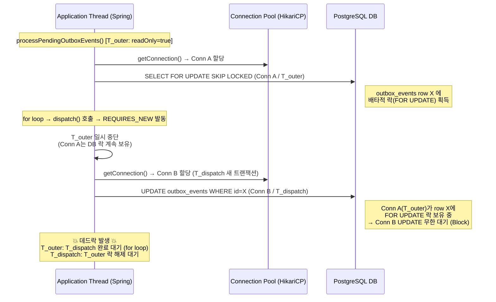
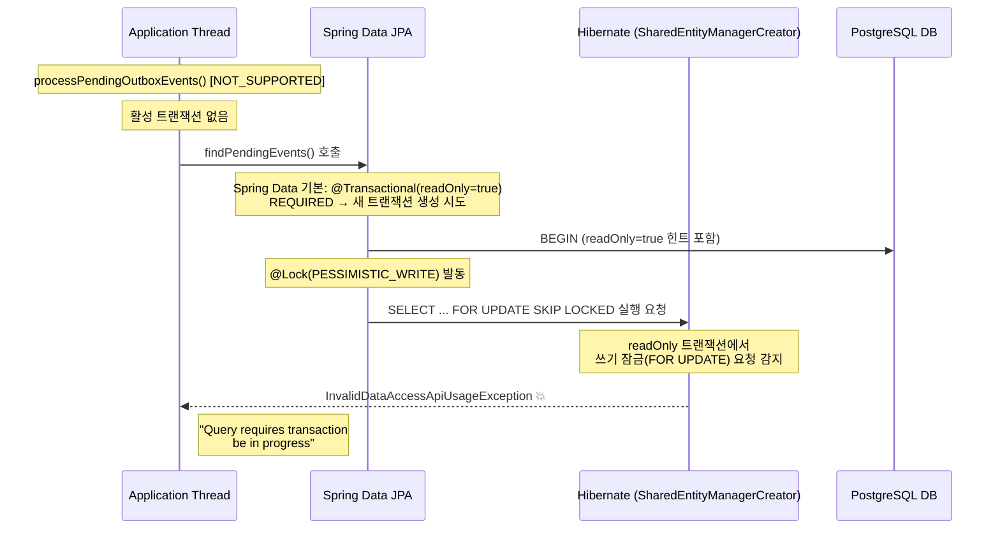
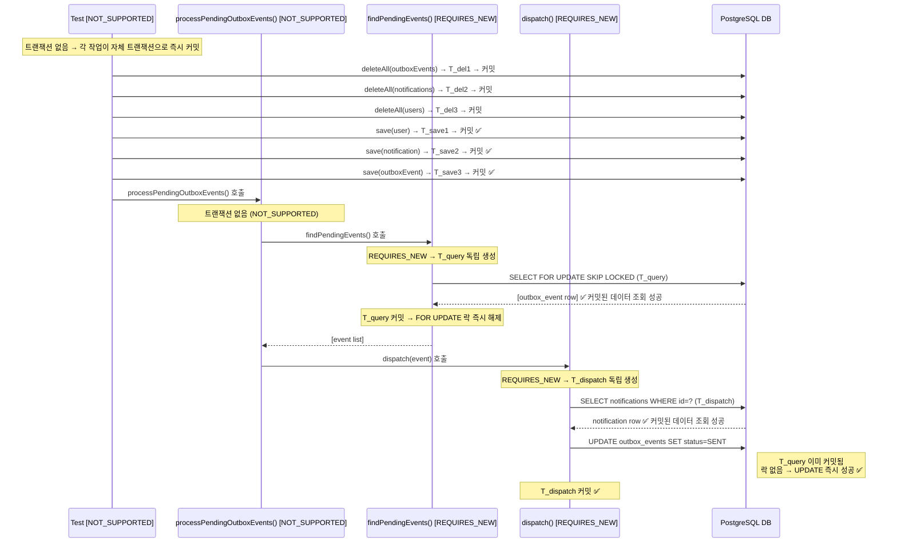

# OutboxPublisher 통합 테스트: REQUIRES_NEW 미커밋 데이터 + FOR UPDATE 데드락 + readOnly 충돌 연쇄

## 0) 메타 정보

- **Mode:** `DEV`
- **Status:** `Resolved`
- **작성자:** 박건우(@geonusp)
- **작성일(필수):** 2026-03-04
- **해결 날짜:** 2026-03-04
- **컴포넌트:** db
- **환경:** local
- **관련 이슈/PR:** PB-88 (OutboxPublisher 통합 테스트)
- **키워드:** `REQUIRES_NEW`, `NOT_SUPPORTED`, `@Lock(PESSIMISTIC_WRITE)`, `FOR UPDATE SKIP LOCKED`, `readOnly`, `InvalidDataAccessApiUsageException`, `deadlock`, `uncommitted data`, `Read Committed`
- **연관 문서:** [outbox-integration-test-uncommitted-data-investigation.md](./outbox-integration-test-uncommitted-data-investigation.md) (선행 이슈: deleteAll + CASCADE 가설 배제 과정)

> ⚠️ **두 문서는 맞물려 있음.**
> 이 문서의 문제는 선행 문서의 Fix 시도(NOT_SUPPORTED 적용) 과정에서 드러났다.
> 각각 독립된 버그가 아니라 하나를 고치려 하면 다음이 나타나는 연쇄 구조.
> **두 Fix를 동시에 적용해야 최종 해결 가능.**
>
> ```
> 선행 문서: 미커밋 데이터 → REQUIRES_NEW 불가시
>     ↓ NOT_SUPPORTED 적용 시도
> 이 문서: readOnly 기본값 + FOR UPDATE 충돌
>     ↓ findPendingEvents REQUIRES_NEW + 테스트 NOT_SUPPORTED 동시 적용
> 최종 해결
> ```

---

## 1) 요약 (3줄)

- **무슨 문제였나:** `OutboxPublisherIntegrationTest` 에서 `processPendingOutboxEvents()` 가 `findPendingEvents()` 에서 항상 빈 리스트를 반환하고, 데드락 위험 + `InvalidDataAccessApiUsageException` 까지 연쇄 발생
- **원인:** ① `IntegrationTest@Transactional` 안에서 테스트 데이터가 커밋되지 않아 `REQUIRES_NEW`(dispatch) 가 못 읽음, ② `readOnly=true` 외부 트랜잭션이 `FOR UPDATE SKIP LOCKED` 락을 잡은 채 `REQUIRES_NEW` 가 같은 row 를 UPDATE 시도 → 데드락, ③ `NOT_SUPPORTED` 적용 시 Spring Data 기본 `readOnly=true` 가 `PESSIMISTIC_WRITE` 와 충돌
- **해결:** `processPendingOutboxEvents()` 를 `NOT_SUPPORTED` 로, `findPendingEvents()` 를 `REQUIRES_NEW` 로, 테스트 클래스에 `NOT_SUPPORTED` 추가

---

## 1-1) 학습 포인트

- **Fast checks (3):**
  - (1) Log: `dispatch()` 진입 전 브레이크포인트에서 `findPendingEvents()` 반환값 확인 → 빈 리스트면 uncommitted 문제
  - (2) Config/Env: `IntegrationTest` 클래스에 `@Transactional` 있는지 + 호출 체인에 `REQUIRES_NEW` 있는지 확인
  - (3) Infra/Dependency: `@Lock(PESSIMISTIC_WRITE)` 메서드에 명시적 `@Transactional(REQUIRES_NEW)` 없으면 Spring Data 기본 `readOnly=true` 의존
- **Rule of thumb (필수):**
  - 크로스-트랜잭션 동작을 검증하는 통합 테스트는 `@Transactional(NOT_SUPPORTED)` 로 트랜잭션을 끊고 `deleteAll()` 로 수동 정리한다.
  - `REQUIRED` 는 기존 tx에 합류할 때 **자신의 `@Transactional` 속성(readOnly, timeout, isolation)을 버리고 외부 tx 설정을 그대로 따른다.** 새 tx를 생성할 때만 자신의 속성이 적용된다. → `@Lock(PESSIMISTIC_WRITE)` 처럼 tx 속성이 중요한 메서드는 `REQUIRES_NEW` 로 항상 자신의 tx를 직접 생성해야 한다.
- **Anti-pattern:**
  - `@Transactional(readOnly=true)` 외부 트랜잭션 + `REQUIRES_NEW` 내부 트랜잭션이 같은 row 를 읽기(FOR UPDATE) / 쓰기(UPDATE) 동시 접근 → 데드락
  - `@Lock(PESSIMISTIC_WRITE)` + Spring Data 기본 `readOnly=true` 의존 → Spring은 `readOnly=true` 세션을 `isActualTransactionActive() = false`(actual 트랜잭션 없음)로 판단하여 `SharedEntityManagerCreator`가 쓰기 잠금 요청을 거부 → `NOT_SUPPORTED` 컨텍스트에서 `InvalidDataAccessApiUsageException` 발생

---

## 2) 증상 (Symptom)

### 관측된 현상

> **Issue A 는 선행 문서에서 다룸** → [outbox-integration-test-uncommitted-data-investigation.md](./outbox-integration-test-uncommitted-data-investigation.md)
> 선행 문서에서 deleteAll + CASCADE 가설 배제 후 `NOT_SUPPORTED` 적용 시도 → 아래 Issue B, C 연쇄 발생

**Issue B: 데드락**
- `processPendingOutboxEvents()` 의 `readOnly=true` 트랜잭션이 `FOR UPDATE SKIP LOCKED` 락 보유
- 같은 row 에 대해 `dispatch()` 의 `REQUIRES_NEW` 트랜잭션이 UPDATE 시도 → 블로킹
- `PSQLException: deadlock detected` 없이 아래 SELECT 쿼리가 무한 반복 출력
  ```sql
  /* <criteria> */ select oe1_0.id, ... from public.outbox_events oe1_0
  /* <criteria> */ select n1_0.id, ... from notifications n1_0
  ```

**Issue C: NOT_SUPPORTED 적용 후 즉시 실패**
- `processPendingOutboxEvents()` 를 `NOT_SUPPORTED` 로 변경하자 `findPendingEvents()` 에서 예외 발생

### 에러 메시지 / 스택트레이스 (필수)

**Issue B 증상 (에러 메시지 없음 — 무한 쿼리 반복):**
```text
Hibernate: /* <criteria> */ select oe1_0.id, oe1_0.created_at, ... from public.outbox_events oe1_0
Hibernate: /* <criteria> */ select oe1_0.id, oe1_0.created_at, ... from public.outbox_events oe1_0
Hibernate: /* <criteria> */ select n1_0.id, n1_0.created_at, ... from notifications n1_0
Hibernate: /* <criteria> */ select n1_0.id, n1_0.created_at, ... from notifications n1_0
... (반복)
```
→ `PSQLException` 없이 테스트가 응답 없이 멈추고 위 SELECT 로그만 계속 출력됨

**Issue C 에러:**
```text
org.springframework.dao.InvalidDataAccessApiUsageException:
  Query requires transaction be in progress, but no transaction is known to be in progress
    at com.beachcheck.service.OutboxPublisher.processPendingOutboxEvents(OutboxPublisher.java:41)
```

### 발생 조건 / 빈도

- **언제:** `OutboxPublisherIntegrationTest` 실행 시 항상 재현
- **빈도:** 항상 (100%)

---

## 3) 영향 범위

- **영향받는 기능:** OutboxPublisher 통합 테스트 전체 (TC1~TC3)
- **영향받는 사용자/데이터:** 테스트 데이터만
- **심각도:** `Medium` - 기능 개발/테스트 진행이 막힘

---

## 4) 재현 방법

### 전제 조건

- `IntegrationTest` 에 클래스 레벨 `@Transactional` 적용
- `OutboxPublisher.processPendingOutboxEvents()` 에 `@Transactional(readOnly=true)` 또는 `NOT_SUPPORTED` 적용
- `OutboxEventRepository.findPendingEvents()` 에 `@Lock(PESSIMISTIC_WRITE)` + SKIP LOCKED, 명시적 `@Transactional` 없음
- `dispatch()` 에 `@Transactional(REQUIRES_NEW)` 적용 (OutboxEventDispatcher)

### 재현 절차 (Issue B: readOnly=true 상태로 테스트 실행)

1. `processPendingOutboxEvents()` 에 `@Transactional(readOnly=true)` 유지, 테스트 데이터가 DB에 커밋된 상태
2. 테스트 실행 → `findPendingEvents()` 가 이벤트를 반환함
3. `dispatch()` 내부 UPDATE 가 FOR UPDATE 락 대기 → 테스트 응답 없이 멈춤
4. SELECT 쿼리 로그가 무한 반복 출력됨

### 재현 절차 (Issue C: NOT_SUPPORTED 적용 후)

1. `processPendingOutboxEvents()` 를 `@Transactional(NOT_SUPPORTED)` 로 변경
2. 테스트 실행
3. `findPendingEvents()` 에서 즉시 `InvalidDataAccessApiUsageException` 발생

---

## 5) 원인 분석 (Root Cause)

### 가설 및 검증

---

#### Issue A: REQUIRES_NEW + 미커밋 데이터

> **이 문서의 범위 밖.** 상세 분석은 선행 문서 참고 → [outbox-integration-test-uncommitted-data-investigation.md](./outbox-integration-test-uncommitted-data-investigation.md)
>
> 요약: `IntegrationTest@Transactional` 이 테스트 데이터를 미커밋 상태로 유지 → `dispatch()` 의 `REQUIRES_NEW` 가 Read Committed 격리로 데이터를 볼 수 없음.
> 선행 문서에서 Fix(NOT_SUPPORTED 적용) 를 시도하는 과정에서 아래 Issue B, C 가 드러남 → **선행 문서 단독으로는 테스트 통과 확인 불가.**

---

#### Issue B: readOnly=true 외부 트랜잭션 + REQUIRES_NEW = 데드락

**가설:** `processPendingOutboxEvents()` 의 `readOnly=true` 트랜잭션이 `FOR UPDATE` 락을 보유한 채 `REQUIRES_NEW` 가 같은 row 를 UPDATE 시도 → 데드락

**메커니즘:**



> **핵심:** Spring 의 transaction "suspend" 는 ThreadLocal 컨텍스트만 교체. **PostgreSQL DB 레벨 락은 T_outer 가 COMMIT/ROLLBACK 할 때까지 절대 해제되지 않는다.**

**왜 `PSQLException: deadlock detected` 없이 쿼리 무한 반복만 보였나?**

- `SKIP LOCKED` 는 SELECT 쿼리 자체는 블로킹 없이 성공 → `T_outer` 는 정상적으로 이벤트 목록을 가져옴
- `dispatch()` 내부 UPDATE 는 `T_outer` 의 FOR UPDATE 락 대기 → 단방향 블로킹 (T_outer → dispatch() 완료 대기 / dispatch() → T_outer 락 해제 대기)
- 단일 스레드에서는 PostgreSQL 이 양방향 교착(deadlock) 으로 감지하지 못하고 lock_timeout 까지 대기
- 그 사이 스케줄러나 setUp() `deleteAll()` → `findAll()` 이 반복 실행되면서 SELECT 쿼리가 로그에 계속 출력

**결론:** ✅ 실제 발생 확인 — `PSQLException` 없이 SELECT 쿼리 무한 반복 후 lock_timeout 초과

---

#### Issue C: NOT_SUPPORTED + Spring Data readOnly=true + PESSIMISTIC_WRITE 충돌

**가설:** `processPendingOutboxEvents()` 를 `NOT_SUPPORTED` 로 변경하면 `findPendingEvents()` 가 Spring Data 기본 `@Transactional(readOnly=true)` 로 새 트랜잭션을 생성하는데, `readOnly=true` + `PESSIMISTIC_WRITE` 가 충돌

**메커니즘:**



**왜 `readOnly=true` 에서 `FOR UPDATE` 가 안 되나?**

Spring 의 `@Transactional(readOnly=true)` 는 Hibernate 의 `FlushMode.MANUAL` 을 설정하고, JDBC 드라이버 레벨에서 `setReadOnly(true)` 힌트를 전달할 수 있음. `PESSIMISTIC_WRITE` (`FOR UPDATE`) 는 쓰기 잠금이므로 readOnly 컨텍스트와 의미 충돌 → `SharedEntityManagerCreator` 가 예외 발생.

**왜 기존(`readOnly=true` 외부 트랜잭션 있을 때)에는 문제 없었나?**
`findPendingEvents()` (REQUIRED) 가 기존 T_outer (readOnly=true 이지만 이미 활성) 에 합류. 이미 시작된 트랜잭션에서 FOR UPDATE 실행은 Hibernate 가 허용. 단, 이 경우 Issue B (데드락) 위험이 생김.

**결론:** ✅ NOT_SUPPORTED + readOnly 기본값 의존의 부작용

---

### 최종 원인 (One-liner)

`IntegrationTest@Transactional` 이 테스트 데이터를 미커밋 상태로 유지하여 `REQUIRES_NEW` 가 데이터를 볼 수 없고, 이를 고치기 위한 `NOT_SUPPORTED` 적용이 `@Lock(PESSIMISTIC_WRITE)` + Spring Data readOnly 기본값과 충돌, 근본적으로 `readOnly=true` 외부 트랜잭션이 FOR UPDATE 락을 보유한 채 `REQUIRES_NEW` 와 공유하여 단일 스레드에서도 데드락이 발생하는 설계 결함

---

## 6) 해결 (Fix)

### 해결 전략

- **유형:** Config change
- **접근:** 각 문제의 트랜잭션 경계를 재설계하여 각 컴포넌트가 자신의 트랜잭션 생명주기를 독립적으로 관리하게 함

### 변경 사항

#### 변경 1: `OutboxPublisher.processPendingOutboxEvents()` — `readOnly=true` → `NOT_SUPPORTED`

```java
// Before
@Transactional(readOnly = true)
public void processPendingOutboxEvents() { ... }

// After
@Transactional(propagation = Propagation.NOT_SUPPORTED)
public void processPendingOutboxEvents() { ... }
```

**이유:**
- `readOnly=true` 상태에서 FOR UPDATE 락 보유 → REQUIRES_NEW 내 UPDATE 시 데드락
- `NOT_SUPPORTED` 로 트랜잭션을 끊으면 `findPendingEvents()` 와 `dispatch()` 가 각자 독립 트랜잭션으로 동작

---

#### 변경 2: `OutboxEventRepository.findPendingEvents()` — `@Transactional(REQUIRES_NEW)` 추가

```java
// Before
@Lock(LockModeType.PESSIMISTIC_WRITE)
@QueryHints({@QueryHint(name = "jakarta.persistence.lock.timeout", value = "-2")})
@Query("SELECT e FROM OutboxEvent e WHERE ...")
List<OutboxEvent> findPendingEvents(Instant now, Pageable pageable);

// After
@Transactional(propagation = Propagation.REQUIRES_NEW)  // 추가: 독립 writable 트랜잭션 보장
@Lock(LockModeType.PESSIMISTIC_WRITE)
@QueryHints({@QueryHint(name = "jakarta.persistence.lock.timeout", value = "-2")})
@Query("SELECT e FROM OutboxEvent e WHERE ...")
List<OutboxEvent> findPendingEvents(Instant now, Pageable pageable);
```

**이유:**
- Spring Data 기본 `readOnly=true` 의존 제거 → `InvalidDataAccessApiUsageException` 해결
- `REQUIRES_NEW` 로 SELECT FOR UPDATE SKIP LOCKED 실행 후 즉시 커밋 → 락 즉시 해제 → `dispatch()` 의 UPDATE 블로킹 없음 → 데드락 해결

---

#### 변경 3: `OutboxPublisherIntegrationTest` — 클래스 레벨 `@Transactional(NOT_SUPPORTED)` 추가

```java
// Before: IntegrationTest 의 @Transactional 상속 (data uncommitted)
class OutboxPublisherIntegrationTest extends IntegrationTest { ... }

// After
@Transactional(propagation = Propagation.NOT_SUPPORTED)  // 추가: @Transactional 상속 오버라이드
class OutboxPublisherIntegrationTest extends IntegrationTest { ... }
```

**이유:**
- `IntegrationTest` 의 `@Transactional` 을 비활성화 → 테스트 데이터가 즉시 커밋됨
- `findPendingEvents()` 의 `REQUIRES_NEW` 트랜잭션에서 커밋된 데이터 조회 가능

---

#### 변경 4: `setUp()` — `deleteAll()` 복구

```java
@BeforeEach
void setUp() throws FirebaseMessagingException {
    clearInvocations(firebaseMessaging);

    // 복구: NOT_SUPPORTED 로 트랜잭션이 없으므로 각 deleteAll() 이 즉시 커밋 → 안전
    outboxEventRepository.deleteAll();
    notificationRepository.deleteAll();
    userRepository.deleteAll();

    given(firebaseMessaging.send(any(Message.class))).willReturn("mock-message-id");
}
```

**이유:**
- `NOT_SUPPORTED` 로 outer 트랜잭션이 없으므로 각 `deleteAll()` 이 자체 트랜잭션으로 즉시 커밋
- JPA ActionQueue 플러시 순서 문제(INSERT → DELETE CASCADE 자폭) 발생 불가

---

### 최종 트랜잭션 흐름 (Fix 후)



### 주의/부작용

- 테스트 자동 롤백 없음 → `setUp()` 의 `deleteAll()` 이 데이터 정리 역할 담당 (트레이드오프 수용)
- `findPendingEvents()` 의 `REQUIRES_NEW` 는 매번 새 트랜잭션을 시작하므로 네트워크 오버헤드가 미세하게 증가 (프로덕션 폴링 성능에 무시할 수준)

---

## 7) 검증 (Verification)

### 해결 확인

> **이 문서(Issue B, C Fix) 적용 후 비로소 테스트 통과 확인.**
> 선행 문서(Issue A)의 Fix 단독으로는 B, C 로 인해 테스트 통과를 볼 수 없었음.
> 세 가지 변경(NOT_SUPPORTED + REQUIRES_NEW + 테스트 NOT_SUPPORTED)을 모두 적용한 시점에 최초로 TC1~TC3 통과.

- [x] TC1: PENDING → FCM → SENT 상태 전이 확인
- [x] TC2: 3개 이벤트 배치 처리 모두 SENT
- [x] TC3: 멱등성 - 이미 SENT 상태면 FCM 전송 스킵
- [x] `findPendingEvents()` 가 커밋된 테스트 데이터 정상 반환 확인
- [x] SELECT 쿼리 무한 반복 없음 (Issue B 해결)
- [x] `InvalidDataAccessApiUsageException` 미발생 확인 (Issue C 해결)
- [x] `IllegalStateException: Notification을 찾을 수 없습니다` 미발생 확인 (Issue A 해결)

### 실행한 커맨드/테스트

```bash
./gradlew test --tests "com.beachcheck.integration.OutboxPublisherIntegrationTest"
```

---

## 8) 재발 방지 (Prevention)

### 방지 조치 체크리스트

- [x] **문서화:** 이 트러블슈팅 문서 작성
- [ ] **가드레일:** `@Lock(PESSIMISTIC_WRITE)` 사용 시 명시적 `@Transactional` 필수 Javadoc 추가
- [ ] **가드레일:** `IntegrationTest` Javadoc 에 "크로스-트랜잭션 테스트는 `NOT_SUPPORTED` 오버라이드 필요" 명시

### 핵심 설계 원칙 (Outbox 폴링 패턴)

```
폴링 메서드 (OutboxPublisher)
  → @Transactional(NOT_SUPPORTED): 트랜잭션 없이 오케스트레이션만

조회 메서드 (findPendingEvents)
  → @Transactional(REQUIRES_NEW): 독립 트랜잭션 → 즉시 커밋 → 락 해제

처리 메서드 (dispatch)
  → @Transactional(REQUIRES_NEW): 독립 트랜잭션 → 처리 + 상태 변경 → 커밋
```

### 참고 문서

- [Spring @Transactional Propagation 공식 문서](https://docs.spring.io/spring-framework/reference/data-access/transaction/declarative/tx-propagation.html)
- [Spring Testing Transactions 공식 문서](https://docs.spring.io/spring-framework/reference/testing/testcontext-framework/tx.html)
- [Vlad Mihalcea - How Hibernate handles @Lock](https://vladmihalcea.com/spring-data-jpa-lock/)
- [연관 이슈: deleteAll + CASCADE 플러시 순서 문제](./outbox-integration-test-uncommitted-data-investigation.md)