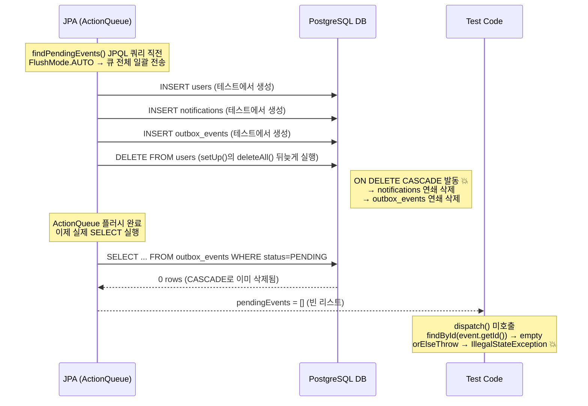

# OutboxPublisher 통합 테스트: REQUIRES_NEW 미커밋 데이터 가시성 문제 초기 분석 (deleteAll + CASCADE 가설 배제)

## 0) 메타 정보

- **Mode:** `DEV`
- **Status:** `Resolved`
- **작성자:** 박건우(@geonusp)
- **작성일(필수):** 2026-03-04
- **해결 날짜:** 2026-03-04
- **컴포넌트:** db
- **환경:** local
- **관련 이슈/PR:** PB-88 (OutboxPublisher 통합 테스트)
- **키워드:** `@Transactional`, `deleteAll`, `ON DELETE CASCADE`, `JPA flush order`, `IllegalStateException`, `orElseThrow`, `OutboxEvent를 찾을 수 없습니다`
- **후속 문서:** [outbox-integration-requires-new-lock-readOnly-deadlock.md](./outbox-integration-requires-new-lock-readOnly-deadlock.md) (가설 1 배제 후 실제 근본 원인 + 최종 Fix)

> ⚠️ **두 문서는 맞물려 있음.**
> 이 문서에서 deleteAll 가설을 배제하고 Fix 시도(NOT_SUPPORTED 적용)를 하는 과정에서 후속 문서의 문제가 드러났다.
> **후속 문서의 Fix까지 동시에 적용해야 최종 해결 가능.**

---

## 1) 요약 (3줄)

- **무슨 문제였나:** 통합 테스트에서 `processPendingOutboxEvents()` 호출 후 `outboxEventRepository.findById()` 가 empty를 반환하며 `orElseThrow` 예외 발생
- **원인 (이 문서 범위):** `@Transactional` 테스트 트랜잭션 안에서 `setUp()`의 `deleteAll()` 이 JPA 플러시 타이밍에 뒤늦게 실행되어 `ON DELETE CASCADE` 가 테스트 데이터를 연쇄 삭제 → **가설로 검증했으나 배제됨** (deleteAll 제거 후에도 에러 지속)
- **실제 근본 원인:** `IntegrationTest@Transactional` 이 테스트 데이터를 미커밋 상태로 유지하여 `dispatch()`의 `REQUIRES_NEW` 가 Read Committed 격리로 데이터를 볼 수 없음 → **[후속 문서](./outbox-integration-requires-new-lock-readOnly-deadlock.md) 에서 해결**

---

## 1-1) 학습 포인트

- **Fast checks (3):**
  - (1) Log: Hibernate SQL 로그에서 INSERT 직후 DELETE 순서 확인
  - (2) Config/Env: `IntegrationTest`에 `@Transactional` 있는지, `setUp()`에 `deleteAll()` 있는지 확인
  - (3) Infra/Dependency: DB 마이그레이션 파일에서 `ON DELETE CASCADE` 존재 여부 확인
- **Rule of thumb (필수):** `@Transactional` 테스트에서는 `deleteAll()` 쓰지 않는다. 필요하다면 `entityManager.flush()` + `entityManager.clear()` 로 플러시 순서를 직접 제어하거나, `@Transactional` 을 제거하고 `@Sql` 로 전략을 바꾼다.
- **Anti-pattern:** `@Transactional` + `@BeforeEach deleteAll()` 혼용 → JPA 플러시 순서 충돌 위험

---

## 2) 증상 (Symptom)

### 관측된 현상
- `processPendingOutboxEvents()` 호출 후 `outboxEventRepository.findById(event.getId())` 가 empty 반환
- 디버거에서 Given 절의 `notification` 객체가 메서드 진입 후 사라지는 것처럼 보임 (실제로는 변수 스코프 이탈이 아니라 DB에서 삭제됨)
- `findPendingEvents()` 가 빈 리스트 반환 → 처리 루프 미실행 → 상태 전이 없음

### 에러 메시지 / 스택트레이스 (필수)
```text
java.lang.IllegalStateException: OutboxEvent를 찾을 수 없습니다
    at com.beachcheck.integration.OutboxPublisherIntegrationTest
        .shouldProcessPendingEventAndMarkAsSent(OutboxPublisherIntegrationTest.java:85)
```

### Hibernate SQL 로그 (결정적 단서)
```text
/* insert for com.beachcheck.domain.Notification */
insert into public.notifications (...) values (...)

/* delete for com.beachcheck.domain.User */
delete from public.users where id=?
```
→ INSERT 직후 DELETE 발생 → CASCADE로 notification 삭제 확인

### 발생 조건 / 빈도
- **언제:** `OutboxPublisherIntegrationTest` 실행 시 항상 재현
- **빈도:** 항상

---

## 3) 영향 범위

- **영향받는 기능:** OutboxPublisher 통합 테스트 전체 (TC1~TC3)
- **영향받는 사용자/데이터:** 테스트 데이터만
- **심각도:** `Medium` - 기능 개발/테스트 진행이 막힘

---

## 4) 재현 방법

### 전제 조건
- `IntegrationTest` 에 `@Transactional` 적용
- `OutboxPublisherIntegrationTest.setUp()` 에 `deleteAll()` 존재
- `V11__create_notifications_table.sql` 에 `ON DELETE CASCADE` 존재

### 재현 절차
1. `OutboxPublisherIntegrationTest.shouldProcessPendingEventAndMarkAsSent()` 실행
2. Given 절: `createAndSaveNotification()` → `createAndSaveOutboxEvent()` 정상 저장 확인
3. `processPendingOutboxEvents()` 호출 직전 브레이크포인트
4. Hibernate SQL 로그 확인: INSERT notification → DELETE users 순서 관찰
5. `outboxEventRepository.findById()` 에서 empty 반환 확인

---

## 5) 원인 분석 (Root Cause)

### 가설 목록

- [ ] 가설 1: `deleteAll()` → CASCADE 체인으로 notification이 dispatch 실행 전에 사라진다
  - **관찰:** 디버거에서 `findPendingEvents()` 직전 기준 OutboxEvent `findAll() size=1` 존재 확인. notification은 dispatch 전에 이미 소멸된 것처럼 보임
  - **추정 경로:** `@BeforeEach setUp()`의 `userRepository.deleteAll()`은 JPA 액션 큐에만 적재되고 즉시 실행되지 않음. 이후 테스트 메서드에서 `save()`들도 큐에 쌓임. `findPendingEvents()` JPQL 쿼리 직전 `FlushMode.AUTO`가 발동하면서 큐 전체가 한꺼번에 DB로 전송됨. 이때 Hibernate 플러시 순서(INSERT 먼저 → DELETE 나중)에 의해 `DELETE FROM users`가 뒤늦게 실행되고, `ON DELETE CASCADE` (V11: users→notifications, V12: notifications→outbox_events) 가 발동하여 방금 INSERT한 데이터를 연쇄 삭제
  - **검증:** `deleteAll()` 세 줄 모두 주석처리
  - **결과:** 에러 메시지 변경 (`OutboxEvent를 찾을 수 없습니다` → `Notification을 찾을 수 없습니다`) 후 여전히 실패 → **배제 (근본 원인 아님)**
  - **참고 문서:**
    - [Vlad Mihalcea - How does AUTO flush strategy work](https://vladmihalcea.com/how-does-the-auto-flush-work-in-jpa-and-hibernate/) → JPQL 쿼리 직전 AUTO flush 발동 원리
    - [Vlad Mihalcea - Hibernate flush operations order](https://vladmihalcea.com/hibernate-facts-knowing-flush-operations-order-matters/) → **ActionQueue** 개념 및 INSERT→DELETE 실행 순서 (큐에 쌓이는 내용)
      > "Every entity state transition generates an action which is enqueued by the Persistence Context."
      > ActionQueue 실행 순서: `OrphanRemovalAction` → `AbstractEntityInsertAction` → `EntityUpdateAction` → `CollectionRemoveAction` → `CollectionUpdateAction` → `CollectionRecreateAction` → **`EntityDeleteAction`** (DELETE가 가장 마지막)
    - [Hibernate 공식 문서 - Flushing](https://docs.hibernate.org/orm/5.2/userguide/html_single/chapters/flushing/Flushing.html) → ActionQueue 실행 순서 공식 명세
    - [DZone - The Dark Side of Hibernate Auto Flush](https://dzone.com/articles/dark-side-hibernate-auto-flush) → AUTO flush 부작용 실사례
- [x] 가설 2: `dispatch()` 의 `REQUIRES_NEW` 가 새 트랜잭션을 열어 테스트의 미커밋 notification을 못 읽음
  - **관찰:** 스택트레이스에서 `TransactionInterceptor` → `OutboxEventDispatcher$SpringCGLIB$0.dispatch` 경로 확인. 프록시를 통해 REQUIRES_NEW 정상 작동 중
  - **결과:** ✅ 확인됨 — `dispatch()` 진입 직전 브레이크포인트에서 `notificationRepository.findAll()` → empty. IntegrationTest 트랜잭션 안에서 실행하면 1건 존재. Read Committed 격리에 의한 가시성 차이.
  - **최종 Fix:** `@Transactional(propagation = NOT_SUPPORTED)` 적용 + `findPendingEvents()` 에 `@Transactional(REQUIRES_NEW)` 추가. 상세 내용은 [후속 문서](./outbox-integration-requires-new-lock-readOnly-deadlock.md) 참고

### 최종 원인 (이 문서 범위: 가설 1 배제)
`@Transactional` 테스트에서 `setUp()` 의 `deleteAll()` 과 테스트 메서드의 `save()` 가 **동일 트랜잭션** 안에 공존하며, JPA가 `findPendingEvents()` 쿼리 직전에 플러시할 때 **Hibernate의 플러시 순서**(INSERT 먼저 → DELETE 나중)로 인해 CASCADE가 발동 → **그러나 이것이 근본 원인이 아님**: `deleteAll()` 3줄 모두 제거 후에도 동일 에러 지속 (에러 메시지만 변경)

**실제 근본 원인** → [outbox-integration-requires-new-lock-readOnly-deadlock.md](./outbox-integration-requires-new-lock-readOnly-deadlock.md) 참고

### 왜 @BeforeEach인데 같은 트랜잭션인가?

`IntegrationTest`에 `@Transactional`이 클래스 레벨로 선언되어 있으면 Spring은 **테스트 메서드 실행 전체(BeforeEach 포함)를 하나의 트랜잭션으로 감싼다.**

```
트랜잭션 시작
  ├─ @BeforeEach clearPersistenceContext() 실행
  ├─ @BeforeEach setUp() 실행         ← deleteAll() 큐에 적재
  └─ @Test 실행                       ← save() 큐에 적재
트랜잭션 종료 (롤백)
```

### 왜 deleteAll()이 즉시 실행되지 않는가?

JPA는 성능 최적화를 위해 변경사항을 **영속성 컨텍스트(1차 캐시)에만 적재**해두고, SQL을 즉시 DB에 보내지 않는다.
SQL이 실제로 DB에 전송되는 시점(flush)은 두 가지다:

| flush 발생 시점 | 설명 |
|---|---|
| 트랜잭션 커밋 | 트랜잭션이 끝날 때 |
| **JPQL 쿼리 실행 직전** | **FlushMode.AUTO (JPA 기본값)** |

→ `findPendingEvents()`는 JPQL 쿼리이므로 **실행 직전에 AUTO FLUSH가 발동**
→ setUp()의 `deleteAll()`을 포함한 큐 전체가 이 시점에 한꺼번에 DB에 전송됨

### 가설 1 예상 SQL 실행 순서 (실제 근본 원인 아님 → 배제)



### 근거
- **로그:** Hibernate SQL 로그에서 `INSERT notifications` 직후 `DELETE FROM users` 순서 확인
- **코드 포인트:** `IntegrationTest.java:20` `@Transactional` / `OutboxPublisherIntegrationTest.java:63-65` `deleteAll()` 3줄
- **DB:** `V11__create_notifications_table.sql:20` `ON DELETE CASCADE`
- **JPA 명세:** Hibernate 플러시 순서는 INSERT → UPDATE → DELETE (호출 순서 보장 없음)

---

## 6) 해결 (Fix)

### 해결 전략 (이 문서 범위: deleteAll 가설 검증)
- **유형:** Config change (검증 목적)
- **접근:** `deleteAll()` 이 근본 원인인지 검증 → 배제됨. 실제 Fix 는 후속 문서 참고.

### 변경 사항 (가설 검증용 임시 조치)

`OutboxPublisherIntegrationTest.java` `setUp()` 에서 `deleteAll()` 주석 처리 → 에러 메시지 변경 (`OutboxEvent를 찾을 수 없습니다` → `Notification을 찾을 수 없습니다`) 확인 → 가설 1 배제

```java
@BeforeEach
void setUp() throws FirebaseMessagingException {
    clearInvocations(firebaseMessaging);

    // 검증: deleteAll() 3줄 주석 처리 → 에러 여전히 발생 → 가설 1 배제
    // outboxEventRepository.deleteAll();
    // notificationRepository.deleteAll();
    // userRepository.deleteAll();

    given(firebaseMessaging.send(any(Message.class))).willReturn("mock-message-id");
}
```

**최종 Fix** (테스트 통과까지) → [outbox-integration-requires-new-lock-readOnly-deadlock.md](./outbox-integration-requires-new-lock-readOnly-deadlock.md) 의 변경 사항 참고

---

## 7) 검증 (Verification)

### 해결 확인 (이 문서 범위: 가설 1 배제 확인)
- [x] `deleteAll()` 제거 후에도 에러 지속 → 가설 1 배제 확인
- [x] 에러 메시지 변경 (`OutboxEvent를 찾을 수 없습니다` → `Notification을 찾을 수 없습니다`) → deleteAll 이 영향 주긴 했지만 근본 원인 아님 확인
- [ ] ~~TC1~TC3 모두 통과~~ → **이 문서의 Fix(NOT_SUPPORTED 적용 시도)만으로는 테스트 통과 불가** — NOT_SUPPORTED 적용 시 후속 문서의 Issue B(데드락), C(`InvalidDataAccessApiUsageException`) 가 연쇄 발생. 실제 테스트 통과는 후속 문서 Fix 동시 적용 후 확인 → [outbox-integration-requires-new-lock-readOnly-deadlock.md](./outbox-integration-requires-new-lock-readOnly-deadlock.md)

### 실행한 커맨드/테스트
```bash
./gradlew test --tests "com.beachcheck.integration.OutboxPublisherIntegrationTest"
```

---

## 8) 재발 방지 (Prevention)

### 방지 조치 체크리스트
- [x] **문서화:** 이 트러블슈팅 문서 작성
- [ ] **테스트 추가:** `IntegrationTest` 에 `deleteAll()` 사용 금지 주석 추가 검토
- [ ] **가드레일:** `IntegrationTest` Javadoc에 "@Transactional 롤백으로 격리. setUp에서 deleteAll() 사용 금지" 명시
