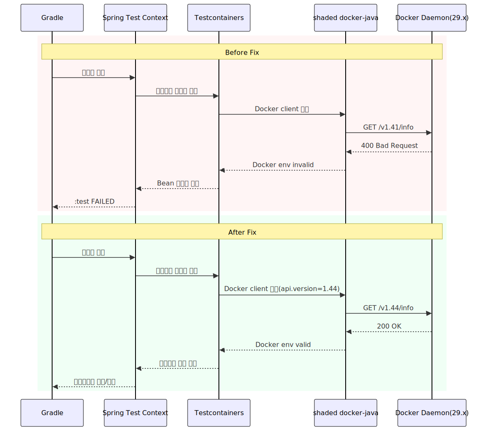

# Testcontainers: Docker Desktop 29.x에서 `Could not find a valid Docker environment` (Status 400) 해결

## 0) 메타 정보
- **Mode:** `DEV`
- **Status:** `Resolved`
- **작성자:** `codex`
- **작성일:** `2026-02-06`
- **컴포넌트:** `infra, docker, ci, test`
- **환경:** `local(WSL + Docker Desktop), ci`
- **관련 이슈/PR:** `PB-86`, `docs/issues/2026-02-05-testcontainers-docker-api-version-400-issue.md`
- **키워드:** `Testcontainers`, `DockerClientProviderStrategy`, `BadRequestException`, `Status 400`, `api.version`

---

## 1) 요약 (3줄)
- **무슨 문제였나:** Testcontainers를 사용하는 통합 테스트가 Docker 환경 탐색 단계에서 실패해 `:test`가 실패했다.
- **원인:** Docker Engine 29.x(최소 API 1.44) 환경에서 Testcontainers 내부 docker client가 `/v1.41/info`를 호출해 400이 발생했다.
- **해결:** Testcontainers 버전을 `1.20.5`로 올리고, 테스트 JVM에 `api.version=1.44`를 고정 주입했다.

## 1-1) 학습 포인트 (최대 3개)
- **Fast checks (3):** (1) Log: `Could not find a valid Docker environment` + `Status 400` 확인 (2) Config/Env: `~/.testcontainers.properties`와 테스트 JVM `api.version` 확인 (3) Infra/Dependency: Docker Engine 최소 API와 Testcontainers 버전 매핑 확인
- **Rule of thumb (필수, 1문장):** Docker 엔진 메이저 업그레이드 시 Testcontainers 통합 테스트는 먼저 API 버전 호환(`api.version`, 라이브러리 버전)을 검증한다.
- **Anti-pattern (선택):** `DOCKER_API_VERSION`만 바꾸고 해결될 것으로 가정하는 방식

---

## 2) 증상 (Symptom)
### 관측된 현상
- `./gradlew test jacocoTestReport` 실행 시 Testcontainers 기반 Integration 테스트가 대량 실패했다.
- 실패 포인트는 테스트 로직이 아니라 Spring Test Context 초기화(Testcontainers 컨테이너 기동) 단계였다.

### 에러 메시지 / 스택트레이스 (필수)
```text
Could not find a valid Docker environment. Please check configuration.
UnixSocketClientProviderStrategy: failed with exception BadRequestException (Status 400: ...)
Execution failed for task ':test'.
> There were failing tests. See the report at: build/reports/tests/test/index.html
```

### 발생 조건 / 빈도
- **언제:** Docker Desktop Engine 29.x 환경에서 Testcontainers 통합테스트 실행 시
- **빈도:** 항상 재현

---

## 3) 영향 범위 (DEV 기준 최소 작성)
- **영향받는 기능:** 통합 테스트 실행, 전체 테스트 파이프라인, Jacoco 전체 리포트 생성
- **영향받는 사용자/데이터:** 개발/CI 파이프라인(운영 데이터 영향 없음)
- **심각도(개발 단계):** `Medium` (통합 테스트 진행이 막힘)

---

## 4) 재현 방법 (Reproduction)
### 전제 조건
- **브랜치/커밋:** 해결 전 상태(기본 Testcontainers 1.19.8), 해결 후는 `build.gradle`에 override 반영
- **의존성/버전:** Java 21, Gradle 8.7, Docker Desktop 4.59.0 / Engine 29.2.0(min API 1.44), Testcontainers 1.19.8(해결 전)
- **환경변수/설정:** `SPRING_PROFILES_ACTIVE=test`, `TESTCONTAINERS_RYUK_DISABLED=true`

### 재현 절차
1. Docker Desktop(Engine 29.x) 실행
2. 프로젝트 루트에서 `./gradlew test jacocoTestReport --no-daemon --stacktrace` 실행
3. 통합 테스트 컨텍스트 로딩 단계에서 `Could not find a valid Docker environment`로 실패

### 재현 입력/데이터
- 요청/페이로드/SQL/테스트 케이스:
```text
테스트 케이스: com.beachcheck.integration.UserFavoriteServiceIntegrationTest
핵심 호출: Docker API /v1.41/info
```

---

## 5) 원인 분석 (Root Cause)
### 가설 목록 (필요 시)
- [x] 가설 1: Docker 데몬 자체 비가동/권한 문제
- [x] 가설 2: Testcontainers 라이브러리/설정의 Docker API 버전 불일치
- [ ] 가설 3: 통합 테스트 비즈니스 로직 자체 결함

### 근거 (로그/코드/설정/DB 상태)
- **로그/지표:** 테스트 XML에서 `BadRequestException (Status 400)` + `Could not find a valid Docker environment` 확인
- **코드 포인트:** `build.gradle`에서 Testcontainers 버전 override 및 테스트 JVM `api.version` 주입으로 증상 소거
- **설정 포인트:** `~/.testcontainers.properties`에 `UnixSocketClientProviderStrategy` 사용 흔적 확인
- **DB 상태:** 영향 없음(컨테이너 기동 이전 실패)

### 시각화 1: 실패 메커니즘(원인 경로)


### 시각화 2: Before/After 실행 시퀀스


### 최종 원인 (One-liner)
- Docker Engine 최소 API(1.44)와 Testcontainers 실행 시 사용된 Docker API 경로(v1.41) 간 버전 불일치로 컨테이너 초기화가 실패했다.

---

## 6) 해결 (Fix)
### 해결 전략
- **유형:** `Config change`
- **접근:** 라이브러리 버전과 런타임 API 버전을 모두 명시해 Docker 엔진과의 호환을 강제한다.

### 변경 사항
- `build.gradle`에 `ext['testcontainers.version'] = '1.20.5'` 추가
- `tasks.withType(Test).configureEach`에 `systemProperty 'api.version', '1.44'` 추가
- 캐시 디렉터리 추적 방지를 위해 `.gitignore`에 `.gradle-user-home/` 추가
- 관련 코드/설정:
  - `build.gradle`
  - `.gitignore`

### 주의/부작용
- Docker 엔진이 매우 오래된 환경(1.44 미만)일 경우 테스트가 오히려 실패할 수 있음
- 조직 내 Docker 버전 표준이 다르면 팀 간 재현성 차이가 생길 수 있음

---

## 7) 검증 (Verification)
### 해결 확인
- [x] 동일 재현 절차로 더 이상 발생하지 않음
- [x] 관련 테스트 통과 (integration + 전체 test)
- [x] 로컬 실행/빌드 정상

### 실행한 커맨드/테스트
```bash
# 의존성 버전 확인
./gradlew dependencyInsight --dependency org.testcontainers:testcontainers --configuration testRuntimeClasspath
./gradlew dependencyInsight --dependency com.github.docker-java:docker-java-api --configuration testRuntimeClasspath

# 통합테스트 스모크
./gradlew test --tests 'com.beachcheck.integration.UserFavoriteServiceIntegrationTest' --no-daemon --stacktrace

# 전체 검증
./gradlew test jacocoTestReport --no-daemon --stacktrace
```

### 추가 확인(선택)
- `curl --unix-socket /var/run/docker.sock http://localhost/v1.41/info`는 400, `v1.44/info`는 200 확인
- `docker version`에서 Engine 29.x / min API 1.44 확인

---

## 8) 재발 방지 (Prevention)
### 방지 조치 체크리스트
- [x] **테스트 추가**: Testcontainers 기반 통합테스트를 스모크로 CI에 유지
- [x] **검증 로직 추가**: 테스트 JVM `api.version` 명시
- [ ] **가드레일**: Docker 최소 버전 사전 점검 스크립트 도입
- [x] **로깅 개선**: Docker 환경 탐색 실패 로그 키워드 문서화
- [x] **문서화**: 본 문서 + 이슈 문서 작성
- [ ] **알림/모니터링**(배포 후): CI 실패 원인 키워드 분류 알림 추가

### 남은 작업(Action Items)
- [ ] CI pre-check로 Docker API 최소 버전 확인 단계(`/_ping`, `/v1.44/info`) 추가
- [ ] 팀 공통 개발환경 문서에 Docker/Testcontainers 호환 버전 표 추가
